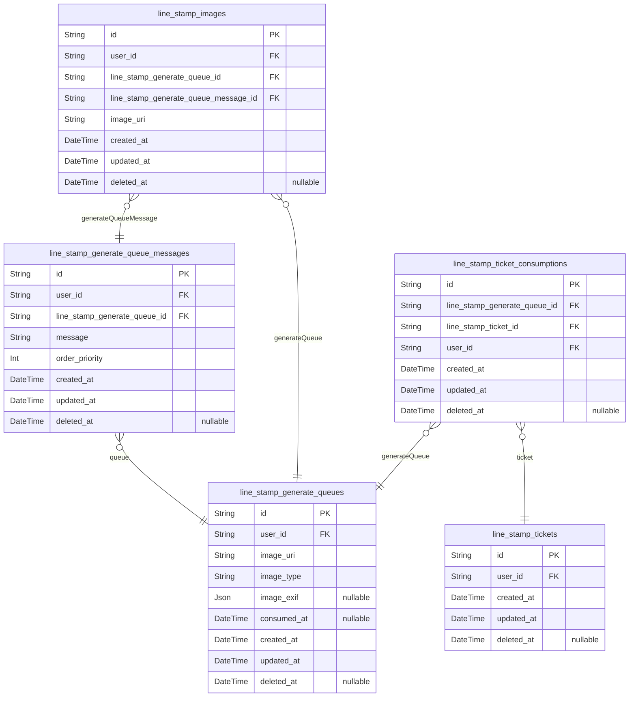
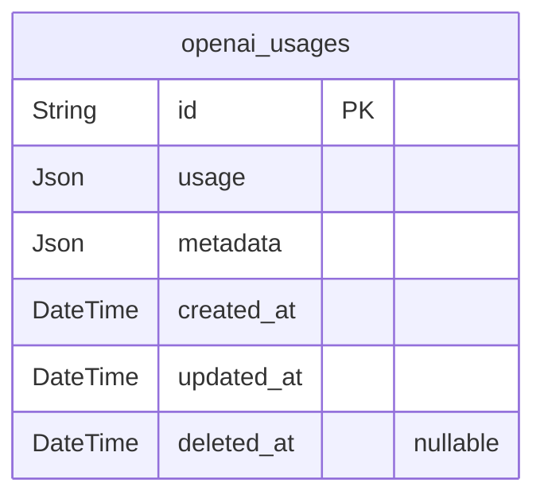
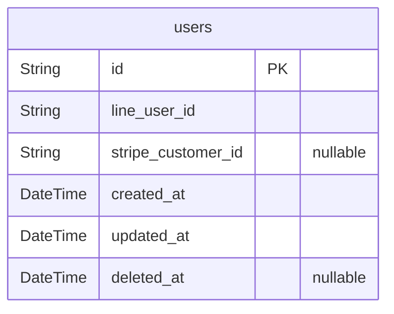

# Schema
> Generated by [`prisma-markdown`](https://github.com/samchon/prisma-markdown)

- [マイスタンプ](#マイスタンプ)
- [外部API](#外部api)
- [認証](#認証)

## マイスタンプ

### `line_stamp_generate_queue_messages`
マイスタンプ生成キュー/メッセージ

**Properties**
  - `id`: 
  - `user_id`: 
  - `line_stamp_generate_queue_id`: 
  - `message`: メッセージ
  - `order_priority`: 並び順
  - `created_at`: 
  - `updated_at`: 
  - `deleted_at`: 

### `line_stamp_generate_queues`
マイスタンプ生成キュー

**Properties**
  - `id`: 
  - `user_id`: 
  - `image_uri`: ベース画像URI
  - `image_type`: ベース画像種別
  - `image_exif`: Exif情報
  - `consumed_at`
    > 処理日時
    > NULL: 未処理
  - `created_at`: 
  - `updated_at`: 
  - `deleted_at`: 

### `line_stamp_images`
マイスタンプ画像

**Properties**
  - `id`: 
  - `user_id`: 
  - `line_stamp_generate_queue_id`: 
  - `line_stamp_generate_queue_message_id`: 
  - `image_uri`: 生成画像URI
  - `created_at`: 
  - `updated_at`: 
  - `deleted_at`: 

### `line_stamp_ticket_consumptions`
マイスタンプチケット使用履歴

**Properties**
  - `id`: 
  - `line_stamp_generate_queue_id`: 
  - `line_stamp_ticket_id`: 
  - `user_id`: 
  - `created_at`: 
  - `updated_at`: 
  - `deleted_at`: 

### `line_stamp_tickets`
マイスタンプチケット

**Properties**
  - `id`: 
  - `user_id`: 
  - `created_at`: 
  - `updated_at`: 
  - `deleted_at`: 

## 外部API

### `openai_usages`
OpenAI使用状況

**Properties**
  - `id`: 
  - `usage`: 
  - `metadata`: 
  - `created_at`: 
  - `updated_at`: 
  - `deleted_at`: 

## 認証

### `users`
ユーザー

**Properties**
  - `id`: 
  - `line_user_id`: LINE User ID
  - `stripe_customer_id`: Stripe Customer ID
  - `created_at`: 
  - `updated_at`: 
  - `deleted_at`: 